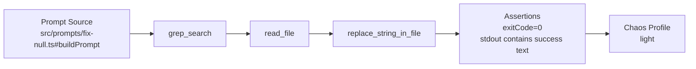

# AI-Native Experience

Status: product direction

This document defines the intended customer experience for agentest in an AI-first workflow.

The runtime and execution engine already exist.
What needs to feel much better is the authoring and review loop around test creation, flow understanding, and chaos evaluation.

## Product Goal

For most users, the experience should not be:

1. install `agentest`
2. learn the schema
3. hand-write YAML
4. guess whether the test structure is correct

The intended experience should be:

1. install `agentest`
2. describe the workflow in natural language
3. let agentest generate the initial spec from built-in skills and project context
4. review the generated test flow visually
5. run baseline and chaos validation
6. inspect where the model or agent drifts under perturbation

## Desired User Journey

### 1. Install

```bash
npm i -D agentest
```

### 2. Create from natural language

```bash
npx agentest create "Test the checkout fix workflow. The agent should search for the bug, read the broken file, apply the null-safe fix, and stop after writing the patch."
```

What `create` should do:

- scan the project for prompt sources and likely MCP tools
- use packaged skill templates for supported agents and workflow patterns
- turn the natural-language intent into either YAML or JS test code
- bind the test to a real prompt source when possible
- generate only the missing structure instead of forcing the user to author the schema from scratch

Expected output:

- a generated `*.agentest.yaml` or `*.agent.test.ts`
- a short natural-language summary of what the generated test asserts
- a confidence warning when the tool inference is weak

## 3. Review the flow before running

```bash
npx agentest flow tests/checkout-fix.agentest.yaml
```

The user should see the test as a workflow graph, not just as raw YAML.

The graph should make these stages obvious:

- prompt source
- mocked tools
- expected tool order
- final success conditions
- chaos profile, if one is configured

Human-readable summary example:

```text
Prompt source: src/prompts/fix-null.ts#buildPrompt
Flow: grep_search -> read_file -> replace_string_in_file
Assertions: exitCode=0, no timeout, stdout contains "Applied null-safe fix"
Chaos profile: light
```

Mermaid-style rendering example:



The visual layer matters because it gives the user a chance to approve the test contract before execution.

## 4. Run baseline and chaos validation

```bash
npx agentest run --chaos light
```

The normal run should still exist.
But the AI-native path should treat chaos evaluation as a first-class operation.

`--chaos` should answer a question that ordinary contract tests do not:

"How stable is this model + agent workflow under realistic perturbation?"

Representative chaos dimensions:

- tool latency spikes
- empty tool results
- partially malformed tool payloads
- repeated or duplicated tool suggestions
- non-critical tool call reordering
- prompt ambiguity or weaker-than-expected completion behavior

Expected output should not be just pass or fail.
It should summarize stability.

Example:

```text
Baseline: PASS
Chaos profile: light
Runs: 20
Pass rate: 85%
Main drift:
- 2 runs skipped replace_string_in_file
- 1 run called read_file twice before patching
Risk level: medium
Suggested action: strengthen the terminal action requirement in the prompt and require replace_string_in_file in the test contract
```

## 5. Explain failures and drift

```bash
npx agentest explain --latest
```

This step should explain:

- whether the failure is a broken test, prompt drift, tool drift, or environment problem
- where the actual flow diverged from the intended flow
- whether the issue appears only under chaos runs or also in baseline runs
- what to change next: prompt, mocks, assertions, or connector setup

## What users should maintain

The user should not have to maintain lots of low-level boilerplate.

The expected maintenance loop is:

1. update the prompt or workflow
2. regenerate or refresh the spec from natural language if the behavior changed materially
3. review the flow graph
4. run baseline and chaos modes
5. accept the updated contract or tighten it

The stable artifact to review in git remains the generated YAML or code.
But authoring should begin from natural language, not from a blank schema file.

## Artifact Model

The helper experience may generate a workspace like this:

```text
.agentest/
  skills/
    default/
      authoring.md
      flow-review.md
      chaos-review.md
  cache/
    project-map.json
  flows/
    checkout-fix.mmd
  reports/
    latest/
      summary.json
      chaos.json
      trace.json
tests/
  checkout-fix.agentest.yaml
```

Rules:

- `tests/*.agentest.yaml` remains the reviewable source artifact
- `.agentest/skills/` contains packaged guidance and agent-facing generation prompts
- `.agentest/flows/*.mmd` stores generated diagrams when the user wants a file artifact
- `.agentest/reports/latest/` stores execution and chaos summaries for `explain`

## Product Principles

- natural language first, schema second
- reviewable generated artifacts, not opaque agent state
- flow visualization before execution when possible
- chaos and stability are core outcomes, not advanced extras
- manual YAML editing remains an escape hatch, not the primary mental model

## Command Shape

The intended high-level command sequence is:

```bash
npx agentest create "<natural language intent>"
npx agentest flow <test-spec>
npx agentest run --chaos light
npx agentest explain --latest
```

The core story should stay focused on `create`, `flow`, `run`, and later `explain` plus chaos evaluation.